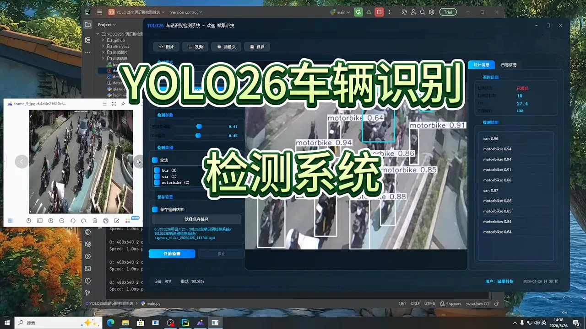
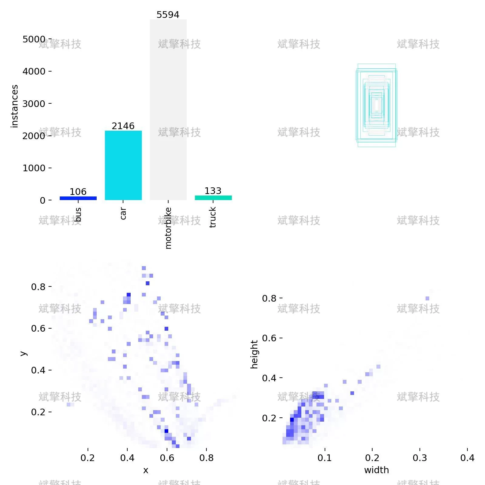
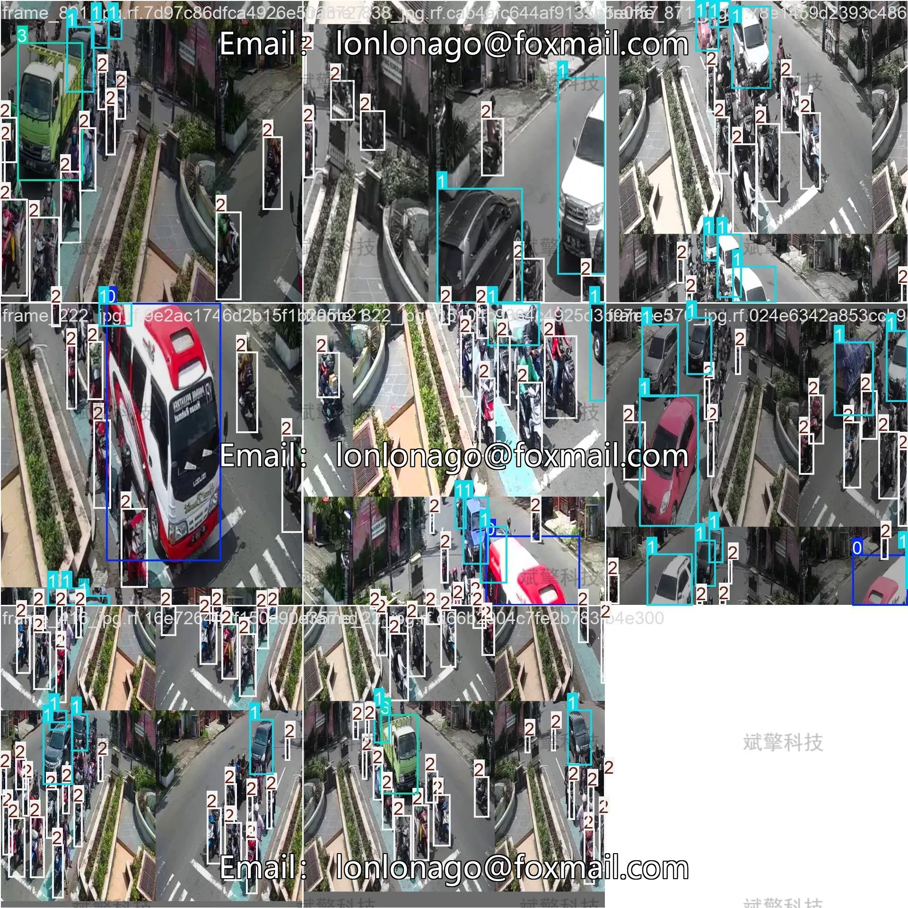
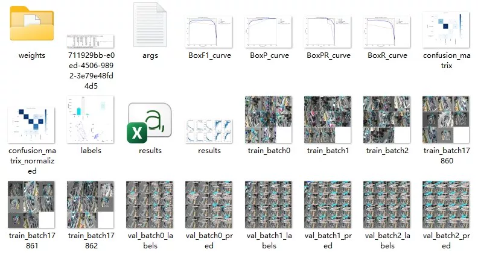
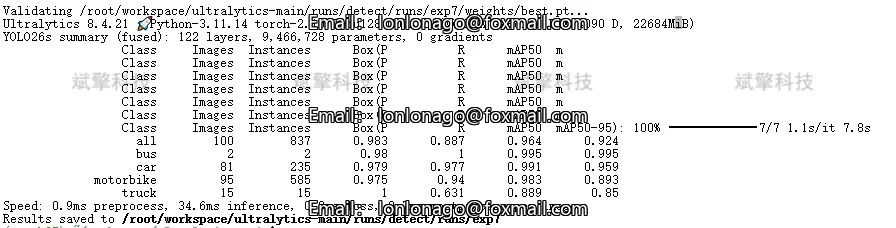
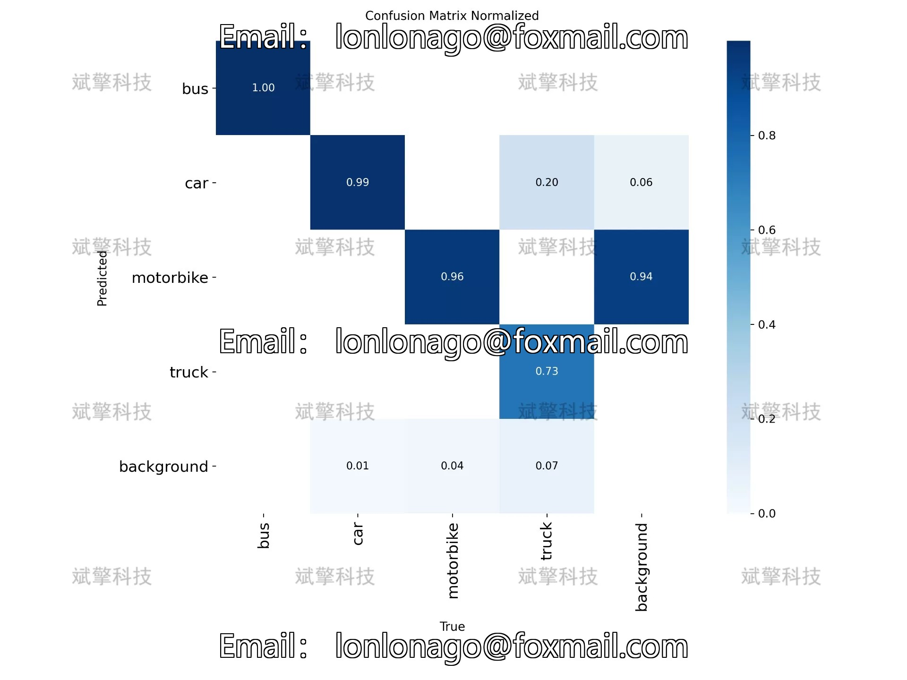
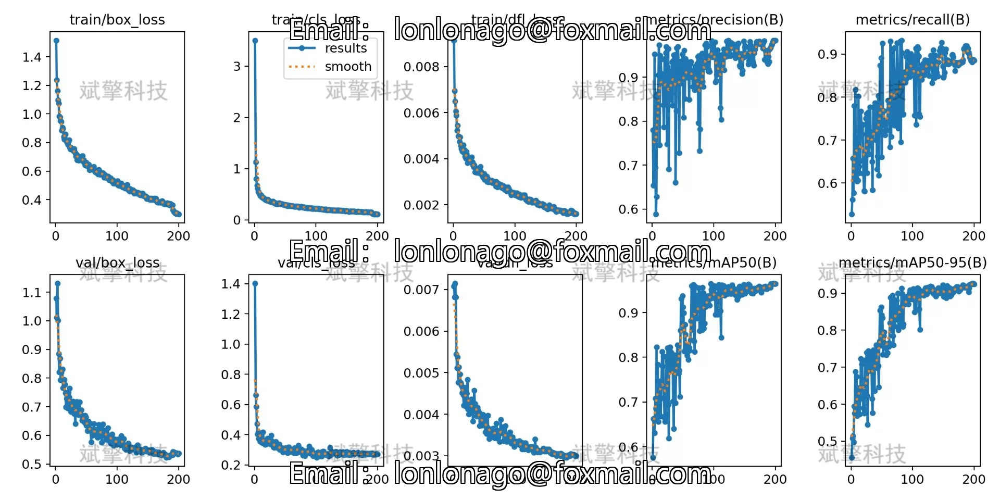
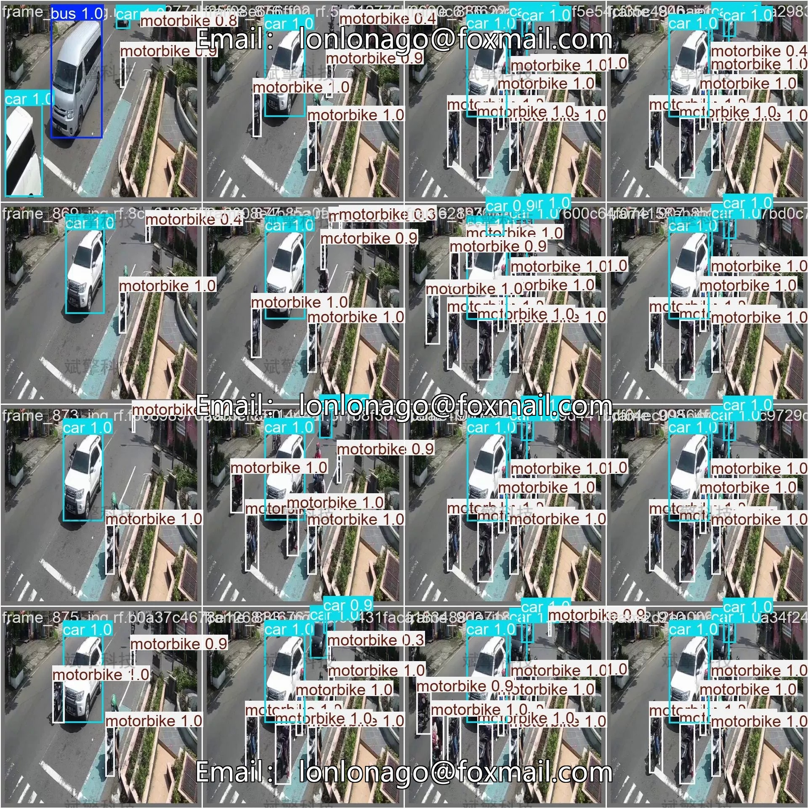
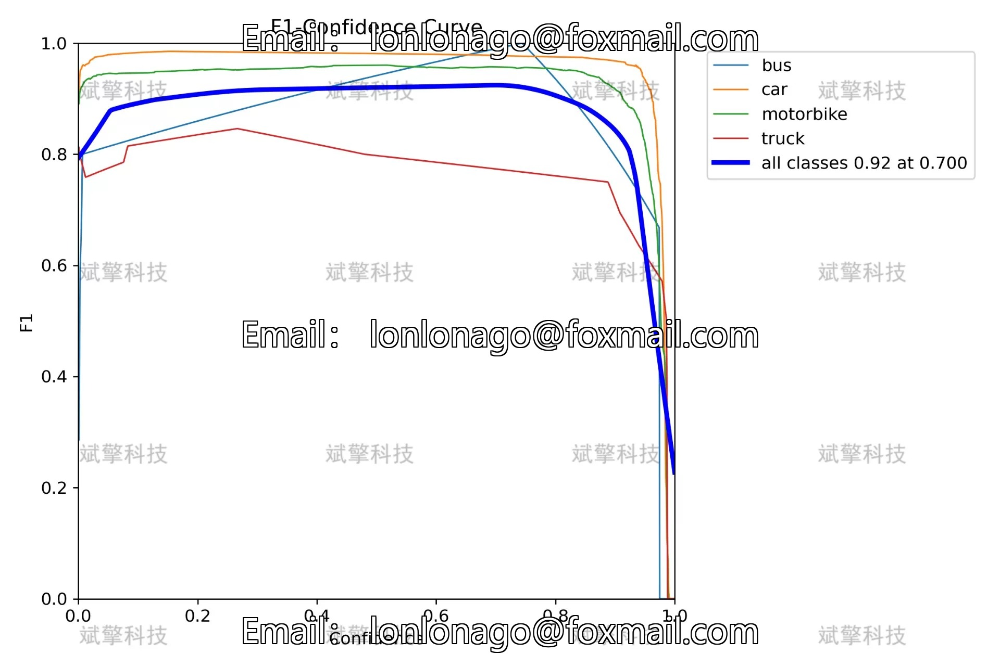

# YOLOv2 Vehicle Classification System | Model + Source Code

## Body

YOLO26 Four-Class Vehicle Detection System | Model + Source Code

With the rapid development of intelligent transportation systems, deep learning-based vehicle detection technology plays an increasingly important role in autonomous driving, traffic monitoring, and urban management. This study builds a four-class vehicle recognition detection system based on the YOLO26 object detection algorithm, including buses, cars, motorcycles, and trucks. The system uses 750 images as the training set, 100 as the validation set, and 150 as the test set. The experimental results show that the model achieved an mAP50 of 96.4% on the validation set, with the recognition accuracy for buses and cars exceeding 99%, but there is a problem with low recall rate (63.1%) for the truck category. Through confusion matrix and performance curve analysis, this study deeply explores the advantages and disadvantages of the model, providing important references for subsequent optimization. This research provides a feasible technical solution and optimization direction for multi-class vehicle detection in intelligent transportation systems.
The dataset contains the following four vehicle categories:
'bus', 'car', 'motorbike', 'truck'

The dataset is divided into training sets, validation sets, and test sets in the ratio of 8:1:1:
Training set: 750 images, used for model parameter learning
Validation set: 100 images, used for model selection and hyperparameter tuning
Test set: 150 images, used for final performance evaluation

Free reservation for remote installation. Unsuccessful full refund.
Purchase enjoy the following resources (Baidu Drive automatically unlocks)
   YOLO Identification Detection Project Complete Source Code
   YOLO format datasets
   Training code + UI interface code
   Trained model + results image
   Software install package
   Add WeChat to make a reservation for remote installation (Automatically display WeChat ID after purchase) - Unsuccessful, full refund

⚙️ Core Function Modules
Detection Capability
    Image Detection: Upon upload, returns detection boxes + category information
    Video Detection: Supports video files, analyzes frames accurately one by one
    Camera Real-time Detection: Connects USB camera, realizes dynamic monitoring
Interaction and Control
    Target Filtering: Choose one or more categories for detection freely
    Parameter Real-time Adjustment: Adjustable confidence threshold & IoU threshold, flexibly control precision
    Result Save: One-click save of image/video/camera detection results
System and Data
    User login registration: Supports password strength detection + encryption storage
    Log recording: Auto records operation and error information (with timestamp)

## Images

## Payment

Here is a pay link on Stripe ( https://buy.stripe.com/3cs8yP7sY87d0vu9AB ). Please contact me lonlonago@foxmail.com after funding $89, and I will send you a complete data files , thank you!

